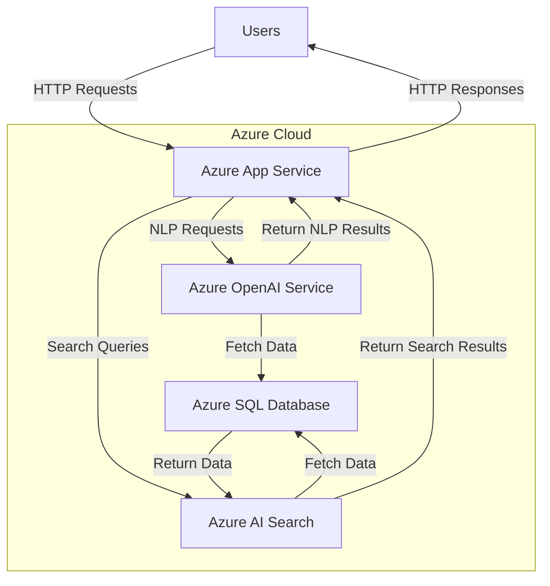
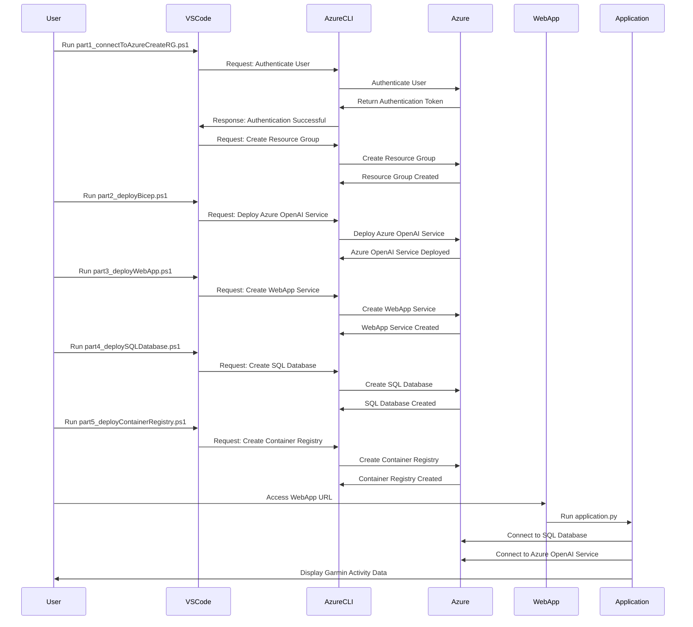
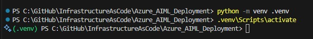

# Azure AIML Deployment

## Introduction

The Azure AIML Application is designed to empower users with advanced data analytics and natural language processing capabilities, leveraging the power of Azure's AI and Machine Learning services. 

This application seamlessly integrates with Azure's robust infrastructure to provide a user-friendly interface for interacting with complex datasets, specifically focusing on Garmin activity data.

## Table of Content

- [Azure AIML Deployment](#azure-aiml-deployment)
  - [Introduction](#introduction)
  - [Table of Content](#table-of-content)
  - [Technical Architecture](#technical-architecture)
    - [Resources Required](#resources-required)
    - [Cloud Environment](#cloud-environment)
      - [Explanation](#explanation)
  - [Features](#features)
  - [Prerequisites](#prerequisites)
  - [Skill Levels to Succeed](#skill-levels-to-succeed)
  - [Setup](#setup)
  - [Running the Application](#running-the-application)
  - [Usage](#usage)

## Technical Architecture



### Resources Required

To deploy this project, you will need the following Azure resources:

- **Azure App Service**: To host the web application.
- **Azure OpenAI Service**: For natural language processing.
- **Azure AI Search**: To perform search queries.
- **Azure SQL Database**: To store and manage Garmin activity data.
- **Azure Resource Group**: To organize and manage related resources.

### Cloud Environment

This project is designed to run with Infrastructure as Code (IaC) in the Azure cloud environment, leveraging Azure's scalable and secure infrastructure to provide reliable and efficient data processing and analytics.

#### Explanation

The sequence diagram illustration below provides a high-level overview of the steps involved in deploying and using the application.py hosted in an Azure WebApp Service, supported by PowerShell and Bicep files.

1. **User Interaction**:
   - The user runs various PowerShell scripts to deploy resources in Azure.

Set Up Environment Variables:

Create a [.env](http://_vscodecontentref_/2) file in the root directory and add the following variables:

    ```env
    AZURE_TENANT_ID=<your-tenant-id>
    AZURE_SUBSCRIPTION_ID=<your-subscription-id>
    AZURE_RESOURCE_GROUP_NAME=<your-resource-group-name>
    OPENAI_CHAT_MODEL=<your-openai-chat-model>
    DB_HOST=<your-sql-server-name>
    DB_NAME=<your-database-name>
    DB_USER=<your-server-user-login-account>
    DB_PASSWORD=<your-db-server-password>
    ```

2. **PowerShell Scripts**:
   - `part1_connectToAzureCreateRG.ps1`: Authenticates the user and creates a resource group.
   - `part2_deployBicep.ps1`: Deploys the Azure OpenAI Service using a Bicep template.
   - `part3_deployWebApp.ps1`: Creates the WebApp Service.
   - `part4_deploySQLDatabase.ps1`: Creates the SQL Database.
   - `part5_deployContainerRegistry.ps1`: Creates the Container Registry.

3. **Azure CLI**:
   - Executes commands to create and deploy resources in Azure.

4. **Azure**:
   - Manages the creation and deployment of resources.

5. **WebApp**:
   - Hosts the application.py script.

6. **Application**:
   - The application.py script connects to the SQL Database and Azure OpenAI Service to display Garmin activity data to the user.



## Features

- **Natural Language Processing**: Utilize Azure OpenAI to interpret and respond to user queries in natural language.
- **Data Visualization**: Present data in a clear and interactive manner using Streamlit.
- **Seamless Integration**: Connect to Azure SQL Database to fetch and analyze data.
- **User-Friendly Interface**: Provide a simple and engaging interface for data interaction.

## Prerequisites

- Python 3.11
- Azure Subscription
- Visual Studio Code (recommended)

## Skill Levels to Succeed

To succeed in this project, you should have the following skills:

- **Basic Knowledge of Python**: Understanding of Python programming and libraries.
- **Familiarity with Azure Services**: Basic knowledge of Azure services like Azure SQL Database, Azure OpenAI, and Azure App Service.
- **Experience with Streamlit**: Familiarity with Streamlit for building interactive web applications.
- **Understanding of Bicep**: Basic understanding of Bicep for deploying Azure resources declaratively.

## Setup

1. **Clone the Repository**:
    ```sh
    git clone https://github.com/yourusername/Azure_AIML_Deployment.git
    cd Azure_AIML_Deployment
    ```

2. **Create and Activate Virtual Environment**:
    ```sh
    python -m venv .venv
    .venv\Scripts\activate  # Windows
    # source .venv/bin/activate  # Linux/macOS    
    ```
    


3. **Install Dependencies**:
    ```sh
    pip install -r requirements.txt
    ```

## Running the Application

**Run the Streamlit Frontend**:
```sh
  streamlit run app.py
```

## Usage

- Open your web browser and navigate to the Streamlit application.
- Interact with your Garmin activity data using natural language queries.
- Visualize the data and gain insights through the user-friendly interface.