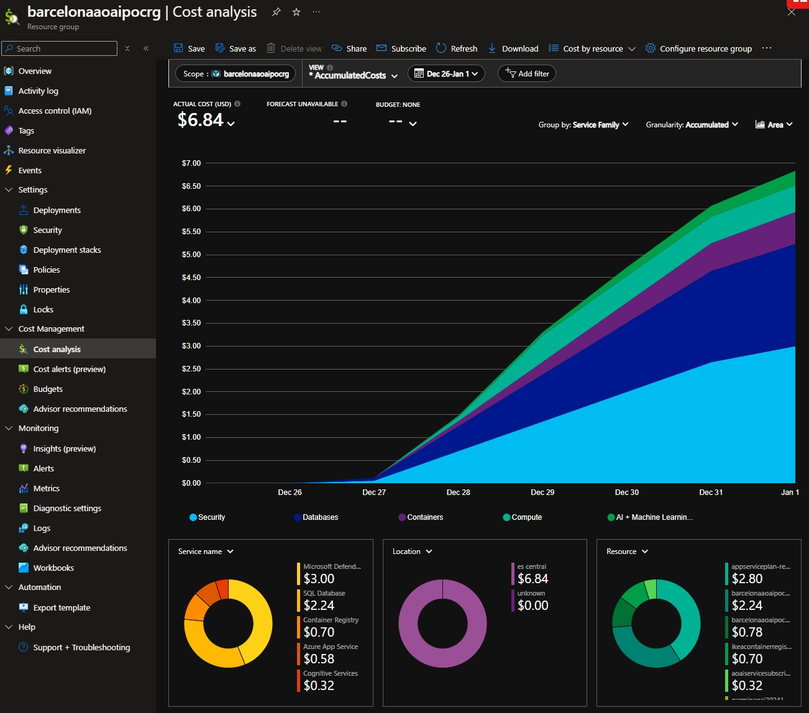

# Azure AIML Deployment

## Introduction

The Azure AIML Application is designed to empower users with advanced data analytics and natural language processing capabilities, leveraging the power of Azure's AI and Machine Learning services. 

This application seamlessly integrates with Azure's robust infrastructure to provide a user-friendly interface for interacting with complex datasets, specifically focusing on my Garmin activity data stored in a Azure SQL Database.


## Table of Content

- [Azure AIML Deployment](#azure-aiml-deployment)
  - [Introduction](#introduction)
  - [Table of Content](#table-of-content)
  - [Technical Architecture](#technical-architecture)
    - [Resources Required](#resources-required)
    - [Cost and Response time Benchmarks](#cost-and-response-time-benchmarks)
    - [Cloud Environment](#cloud-environment)
      - [Explanation](#explanation)
  - [Making the System Ready](#making-the-system-ready)
  - [Preparing the Project Requisites](#preparing-the-project-requisites)
    - [Prerequisite #1: Install Required PowerShell Modules](#prerequisite-1-install-required-powershell-modules)
    - [Prerequisite #2: Install Visual Studio Code](#prerequisite-2-install-visual-studio-code)
  - [Features](#features)
  - [Prerequisites](#prerequisites)
  - [Skill Levels to Succeed](#skill-levels-to-succeed)
  - [Setup](#setup)
  - [Running the Application](#running-the-application)
  - [Usage](#usage)

## Technical Architecture


## Features

- **Natural Language Processing**: Utilize Azure OpenAI to interpret and respond to user queries in natural language.
- **Data Visualization**: Present data in a clear and interactive manner using Streamlit.
- **Seamless Integration**: Connect to Azure SQL Database to fetch and analyze data.
- **User-Friendly Interface**: Provide a simple and engaging interface for data interaction.

## Skill Levels to Succeed

To succeed in this project, you should have the following skills:

- **Basic Knowledge of Python**: Understanding of Python programming and libraries.
- **Familiarity with Azure Services**: Basic knowledge of Azure services like Azure SQL Database, Azure OpenAI, and Azure App Service.
- **Experience with Streamlit**: Familiarity with Streamlit for building interactive web applications.
- **Understanding of Bicep**: Basic understanding of Bicep for deploying Azure resources declaratively.

## Prerequisites

- Python 3.11.0rc2
- Azure Subscription
- Visual Studio Code (recommended)
- Microsoft ODBC Driver Installed on Local PC for testing before publishing on the cloud

### Resources Required

To deploy this project, you will need the following Azure resources:

- **Azure App Service**: To host the web application.
- **Azure OpenAI Service**: For natural language processing.
- **Azure AI Search**: To perform search queries.
- **Azure SQL Database**: To store and manage Garmin activity data.
- **Azure Resource Group**: To organize and manage related resources.

### Cost and Response time Benchmarks

After testing for 3 consecutive days, it has been observed a total cost under 7 Dollars (roughly US $2.3 Dollars/Day or US $70 Dollars/month, with a few regular daily chats with the data for 30 consecutive days), as can be seen below, with a sample illustrating the number of requests and the cost snapshot.

Graph 1: (Re)Deployment Time - Given multiple deployment attempts, with the corret local pc environment setup, the re-deployment of this solution in a whole new reagion is typically taking anywhere between about 3.5 minutes to 5 minutes to be successfully deployed


Graph 2: End User Experience/SLA - Next image shows the POC Performance as response time, between 2 seconds (2k milliseconds) and 7 seconds (7k milliseconds) with the current non optimum python code as-is:


Graph 3: Cost - this next screenshot shows the POC Cost of roughly US $7 dollars for a small load test over 4 days period, given the type of resources I've chosen and SKU.



### Cloud Environment

This project is designed to run with Infrastructure as Code (IaC) in the Azure cloud environment, leveraging Azure's scalable and secure infrastructure to provide reliable and efficient data processing and analytics.

#### Explanation

The sequence diagram illustration below provides a high-level overview of the steps involved in deploying and using the application.py hosted in an Azure WebApp Service, supported by PowerShell and Bicep files.

1. **User Interaction**:

## Making the System Ready - Preparing the Project Requisites

### Prerequisite #1: Install Required PowerShell Modules

It is important that your PowerShell has the necessary modules installed.

1. **Check Azure CLI Version**: If you are not sure that your PowerShell already supports Azure CLI, run the following command to check the version, and update to the latest if necessary:
    ```sh
    az --version
    ```

2. **Install Azure CLI**: To install the Azure CLI PowerShell module, run the following command on your local PC:
    ```sh
    Invoke-WebRequest -Uri https://aka.ms/installazurecliwindows -OutFile .\AzureCLI.msi; Start-Process msiexec.exe -ArgumentList '/I AzureCLI.msi /quiet' -Wait; Remove-Item .\AzureCLI.msi
    ```

3. **Verify Installation**: After successful installation, check the version of Azure CLI running:
    ```sh
    az --version
    ```

4. **Install dotenv Module**: To install the dotenv PowerShell module, run the following command:
    ```sh
    Install-Module -Name dotenv
    ```

5. **Import dotenv Module**: Import the dotenv module into your PowerShell session:
    ```sh
    Import-Module dotenv
    ```

### Prerequisite #2: Install ODBC

Your Windows PC needs to have the Microsoft SQL ODBC Driver installed, that will allow during the local testing of the Local Python Application to interact with your Azure SQL in the cloud.

Using the following Link [SQL ODBC Driver Install Page](https://learn.microsoft.com/en-us/sql/connect/odbc/download-odbc-driver-for-sql-server?view=sql-server-ver16)

Microsoft ODBC Driver for SQL Server is a single dynamic-link library (DLL) containing run-time support for applications using native-code APIs to connect to SQL Server. Use Microsoft ODBC Driver 18 for SQL Server to create new applications or enhance existing applications that need to take advantage of newer SQL Server features.

### Prerequisite #3: Install the Git Bash on your Windows PC

There are many ways to make a copy of this project to your local PC. If you would like to use the git command to clone the code repository for this github project to your local pc, you will need to have Git installed. 

Using the following Link [Git Bash installation Page](https://git-scm.com/downloads/win)

### Prerequisite #4: Install Visual Studio Code

Visual Studio Code (VS Code) is a powerful and lightweight code editor that you will use to develop and manage your project. Follow the steps below to download and install VS Code on your machine:

1. Visit the [Visual Studio Code download page](https://code.visualstudio.com/Download).
2. Choose the appropriate installer for your operating system (Windows, macOS, or Linux).
3. Download the installer and follow the installation instructions provided on the website.

The following VS Code extensions are recommended:

1. **Mermaid**: Helps to visualize diagrams found in this project.
2. **Docker**: Required for later containerizing the application.
3. **Azure Tools**: Helps with Azure libraries.
4. **Python**: Will help handle the application that has been built in Python.
5. **PowerShell**: Will help with handling commands in the terminal during this project.
6. **Bicep**: Helps with handling the resource deployment templates.

Once installed, you can use VS Code to open your project folder and start coding.

1. **Clone the Repository**:
The first step is to clone the this repository to your newly deployed VS Code.

To make it possible, let's open a new folder for this project inside your VS Code and let's open a new terminal session in side your VS Code.


Now, you can run the following `git clone` command seen below to make a local copy of this code repository into your local VS Code Project workspace for this POC.

    ```
      git clone https://github.com/martoscloudarchitect/Azure_SQL_with_OpenAI_Infrascture_as_Code.git
      cd <New_Project_Folder>
    ```
    
**Define Your Resource and Environment Variables:**
   - The user runs various PowerShell scripts to deploy resources in Azure.

Create a [.env](http://_vscodecontentref_/2) file in the root directory and add the following variables:

    ```.env
    AZURE_TENANT_ID=<your-tenant-id>
    AZURE_SUBSCRIPTION_ID=<your-subscription-id>
    AZURE_DEPLOYMENT_REGION=<your-resource-group-target-region>
    AZURE_RESOURCE_GROUP_NAME=<your-resource-group-name>
    
    OPENAI_CHAT_MODEL=<your-openai-chat-model>
    OPENAI_API_BASE=https://<YOUR-AZURE-OPENAI-SERVICE>.api.cognitive.microsoft.com/
    OPENAI_API_KEY=<YOUR-AZURE-OPENAI-SERVICE-KEY>
    
    SQL_SERVER_NAME=<YOUR-AZURE-SQL-SERVER-NAME>
    SQL_SERVER_ENDPOINT=<YOUR-AZURE-SQL-SERVER-NAME>.database.windows.net
    SQL_SERVER_PORT=1433
    SQL_SERVER_USERNAME=<YOUR-AZURE-SQL-SERVER-USERNAME>
    SQL_SERVER_PASSWORD=<YOUR-AZURE-SQL-SERVER-PSWD>
    SQL_DB_NAME=<YOUR-AZURE-SQL-DATABASE-NAME>
    ```

1. **PowerShell Scripts**:
   - `part1_connectToAzureCreateRG.ps1`: Authenticates the user and creates a resource group.
   - `part2_deploy_aoai.ps1`: Deploys the Azure OpenAI Service using a Bicep template.
   - `part3_deploy_AppService.ps1`: Creates the WebApp Service.
   - `part4_deploy_AzureSql.ps1`: Creates the SQL Database.
   - `part5_deploy_ContainerRegistry.ps1`: Creates the Container Registry.
  
To run each of the powershel scripts, as is, you just need to double-click to open the file on the main project space in your VS Code, and then click on the "play button" located on the top left corner of your VS Code as per illustration picture below.


3. **Azure CLI**:
   - Executes commands to create and deploy resources in Azure.

4. **Azure**:
   - Manages the creation and deployment of resources.

5. **WebApp**:
   - Hosts the application.py script.

6. **Application**:
   - The application.py script connects to the SQL Database and Azure OpenAI Service to display Garmin activity data to the user.
  


### Prerequisite #3: Python Environment Setup

1. **Create and Activate Virtual Environment**:

In your local VS Code, open a new terminal session and create a virtual environment. This will wrap your project into a reproduceable environment that can be deployed with expected behavior from another environment outside your local pc.

    ```sh
      python -m venv .venv
      .venv\Scripts\activate  # Windows
      # source .venv/bin/activate  # Linux/macOS    
    ```


2. **Install Python Application Dependencies**:
This python project has been defined with certain python library dependencies. Run the following command below to install the python required libraries into your newly created virtual environment.

    ```sh
    pip install -r requirements.txt
    ```

## Running the Application

**Run the Streamlit Frontend**:
```sh
  streamlit run application.py
```

## Usage

- Open your web browser and navigate to the Streamlit application.
- Interact with your Garmin activity data using natural language queries.
- Visualize the data and gain insights through the user-friendly interface.


